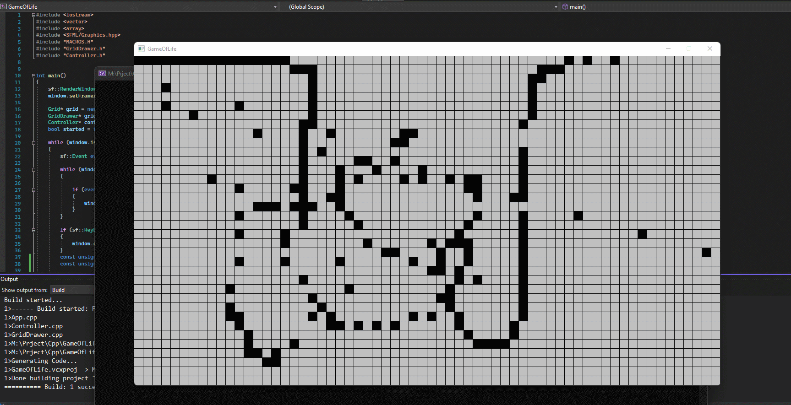

# GameOfLife

# Introduction

Conway's Game of Life or Life or GOF is a Cellular automated game
created by British Mathmetician John Conway in 1970 in which cell is alive or dead.
Each Cell's next generation state is determined by the current state of its 8 neighbours 
(up, left, down, right, upleft, downright, downleft, upright).
The Game future states depends solely on its initial state.

# Rules

if a Cell is Dead : 

    it will be alive in the next generation(step) if it has exactly 3 alive neighhours 

if a Cell is Alive :

    it will die if it has 4 or more alive neighbours due to overpopulation.

    it will die if it has 1 or less alive neighbours due to underpopulation.

    it will continue to live to the next generation if it has 2 or 3 alive neighbours.
    
  
# Why it is Important
  
  The Game of Life is Undecidable.
  A person cannot logically or mathematically predict exactly the future state of the game
  over a finite amount of time.
  It is very interseting and fun way to show and discuss undecidability in Mathmetaics.
        
[More on Undecidability](https://en.wikipedia.org/wiki/Undecidable_problem)  
[More on Conway's Game of Life](https://en.wikipedia.org/wiki/Conway%27s_Game_of_Life)
        
     
  
  
 
